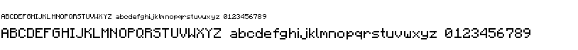

pixfont
=======

A simple, lightweight Pixel Font (aka bitmap fonts) package for Go that works
with the standard `image/draw` package. If you want scaling, anti-aliasing,
TrueType fonts, or other "fancy" features then I suggest you check out
https://code.google.com/p/freetype-go/

However, if you just want to put a little bit of text in your generated image
and don't care about aliasing, or if you can't afford run-time font
dependencies or additional overhead, or you need something that "just works"...
Well then `pixfont` has exactly what you want.

`pixfont` comes ready-to-go with a public domain 8x8 pixel fixed-width font
from the bygone era of PCs (created by Marcel Sondaar / IBM).

Basic, *just-put-some-text-in-my-image* usage is straightforward:

```go

package main

import (
        "image"
        "image/color"
        "image/png"
        "os"

        "github.com/pbnjay/pixfont"
)

func main() {
        img := image.NewRGBA(image.Rect(0, 0, 150, 30))

        pixfont.DrawString(img, 10, 10, "Hello, World!", color.Black)

        f, _ := os.OpenFile("hello.png", os.O_CREATE|os.O_RDWR, 0644)
        png.Encode(f, img)
}

```

Resulting Image: 


Roll your own font
------------------

The default font isn't what you're looking for? Here's how to create your own pixel font for use with this package.

**Step one**: Create a .png image of all the characters you want to include in a single row. For example, say we want to use the great font [Minecraftia by Andrew Tyler](http://andrewtyler.net/fonts/). Here's a copy of the preview image provided with the download.



**Step two**: Find the start offset and list of characters in order. In the image above, we have a start offset of 1,20 and characters A-Z a-z 0-9. Many more are available in the real font, which could be extracted as well with a more complete image.

**Step three**: If you're lucky, just run fontgen on the image to create your font:

```bash
$ ./fontgen -x=1 -y=20 -h=8 -a="ABCDEFGHIJKLMNOPQRSTUVWXYZabcdefghijklmnopqrstuvwxyz0123456789" -img minecraftia.png -o minecraftia
```

In the minecraftia example however, we need to do a minor edit before we can generate the pixfont code, so we follow the alternate path:

**Step three**: Run fontgen on the image and create an intermedia text representation:

```bash
$ ./fontgen -x=1 -y=20 -h=8 -a="ABCDEFGHIJKLMNOPQRSTUVWXYZabcdefghijklmnopqrstuvwxyz0123456789" -img minecraftia.png > minecraftia.txt
```

**Step four**: Review the text version to be sure that all characters matched up correctly. The first character on each line is the letter being mapped, and either a space or an 'X' occurs between the square brackets to denote the pixels.

In Minecraftia, the tail of the lowercase L touches the lowercase M, causing the automatic extracter to merge the characters:

			l  [X      ]
			l  [X      ]
			l  [X XX X ]
			l  [X X X X]
			l  [X X X X]
			l  [X X   X]
			l  [ XX   X]
			l  [       ]
			m  [       ]
			m  [       ]
			m  [ XXXX  ]
			m  [ X   X ]
			m  [ X   X ]
			m  [ X   X ]
			m  [ X   X ]
			m  [       ]

The easiest way to handle this without making a new image is to remove an l or m from the -a alphabet parameter, and edit the intermediate text file to separate the letters:

```bash
$ ./fontgen -x=1 -y=20 -h=8 -a="ABCDEFGHIJKLMNOPQRSTUVWXYZabcdefghijklnopqrstuvwxyz0123456789" -img minecraftia.png > minecraftia.txt
$ vim minecraftia.txt
```

**Step five**: Generate the output file using the intermediate text file:

```bash
$ ./fontgen -txt minecraftia.txt -o minecraftia
```

Now just import the font into your code. For example, to use Minecraftia in the Hello World example above:

```go
// file main.go

package main

import (
        "image"
        "image/color"
        "image/png"
        "os"

        "main/minecraftia"
)

func main() {
        img := image.NewRGBA(image.Rect(0, 0, 150, 30))

        minecraftia.Font.DrawString(img, 10, 10, "Hello, World!", color.Black)

        f, _ := os.OpenFile("hello.png", os.O_CREATE|os.O_RDWR, 0644)
        png.Encode(f, img)
}

```

Resulting Image:  -- Note the missing `,` and `!` since they were not included in the extracted character set. I'll leave inclusion of those as an excercise for the reader.

Variable Width Fonts
--------------------

To create a variable width font (i.e. an `i` is skinnier than a `w`), just add ``-v`` to all invocations of ``fontgen``. When you need to make edits to the font, just ensure that characters are flush with the left edge for best display.

Here's the minecraftia result image with a variable width: 

License
-------

Code for this package is release under the MIT License, use it as you wish. As previously stated, the 8x8 font was released into the public domain by Marcel Sondaar / IBM.
